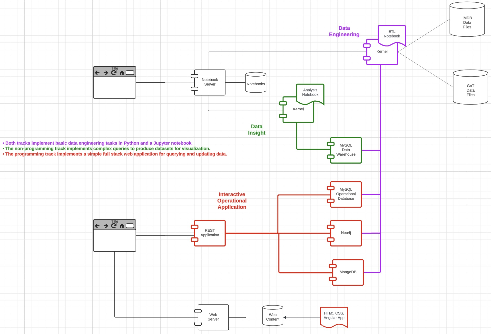
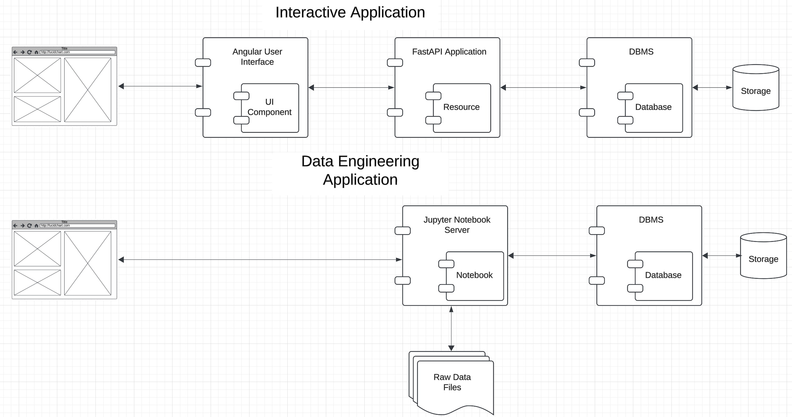

# W4111-Project-Template

## Introduction

Students in Professor Ferguson's section of
[W4111 - Introduction to Databases](https://donald-f-ferguson.github.io/W4111-Introduction-to-Databases-New/)
implement a simple project during the semester. The students implement the project incrementally. Each homework
assignment adds capabilities and functions to the project. This repository is the example and "get stated" project
for the class. 

W4111 has a _programming track_ and a _non-programming track._ The programming track implements a simple
[full stack web application.](https://www.w3schools.com/whatis/whatis_fullstack.asp) Students in the
non-programming track implement a simple data engineering and analysis application. Students choose their own
application scenario and datasets, but the project must meet a set of requirements that the assignments specify.
Professor Ferguson's example starts with two datasets:
- [IMDB](https://developer.imdb.com/non-commercial-datasets/)
- [Game of Thrones](https://github.com/jeffreylancaster/game-of-thrones)

The remainder of this README explains the example project and repository structure in a little more detail. We
will flesh out the example during the semester.

## Application

|            |
|:-----------------------------------:|
| __Project High Level Architecture__ |

Overly simplistically, there are two primary types of applications that use databases:
1. Interactive, operational systems that enable users to create, read, update and
delete information.
2. Decision support applications that enable users to query and analyze data to produce
reports, information, etc. that enables them to make strategy, planning, ... ... decisions.

The programming tracks builds an interactive, operational web application. The
non-programming track builds a simple decision support application. W4111 is a database course,
not a data science course. So, the emphasis of the project is [data engineering](https://en.wikipedia.org/wiki/Data_engineering).

The preceding figure is a high-level, logical architecture diagram for a system combining
both an operational application and a decision support application. 

More specifically,
- The programming track implements:
  - A simple browser based web application using Angular, React, etc.
  - A database schema and queries for interacting with data. The first few phases only use a relational database.
  - A middle tier [REST](https://en.wikipedia.org/wiki/REST) application.
- The non-programming track implements
  - A database schema and queries for interacting with data. The first few phases only use a relational database.
  - Data engineering function in a Jupyter notebook that processes raw data file in various formats (CSV, JSON)
    and loads the data into a relational database.
  - Database queries that clean and transform the data.
  - A set of simple visualizations to provide basic data insight.

|  |
|:-----------------------------:|
|   __Application Elements__    |

Lectures and recitations will provide more detail on the application elements and technology during the semester.

## Repository Overview

The repository contains the following folders:
- _data_ contains the datasets used in the example.
- _data\_engineering_ contains example scripts for data engineering, e.g. loading, cleaning, transforming, ... data.
- _data\_insight_ contains examples for querying data and producing visualizations.
- _interactive\_application_ contains the example full-stack web application. It has the following subdirectories:
  - _application_ is the FastAPI REST application.
  - _database_ contains database set up and query examples.
  - _web\_ui_ is the sample Angular application.
  - _utils_ contains various helper code and scripts.

